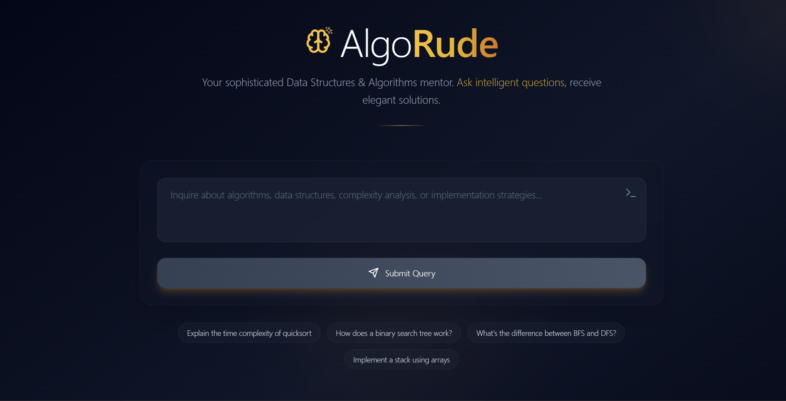

AlgoRude - The Algorithm Tutor With Attitude
Overview
AlgoRude is a web application that provides a clean, modern interface for interacting with a Google Gemini AI-powered chatbot. The chatbot is designed to answer Data Structures and Algorithms (DSA) questions politely while responding rudely to off-topic queries. The website features a mobile-responsive design, error handling for API failures, and a loading indicator for a seamless user experience. It is built using HTML, CSS, and JavaScript.

Live Demo
Check out the live demo: https://coruscating-baklava-240419.netlify.app/

Features

Modern Interface: Includes a header, input area, and response display section for a clean user experience.
Text Input and Submit Button: Users can enter questions and submit them to the Gemini API.
Response Display: AI responses are formatted clearly in a dedicated response area.
Topic-Based Responses:
Polite, detailed answers for DSA-related questions (e.g., "How does a binary search tree work?").
Rude responses for off-topic questions (e.g., "What's your favorite color?").

Error Handling: Displays user-friendly error messages for API failures (e.g., invalid API key or network issues).
Mobile-Responsive Design: Adapts seamlessly to various screen sizes.
Loading Indicator: Shows a spinner while waiting for API responses.
Deployment-Ready: Optimized for static hosting platforms like Netlify, Vercel, or GitHub Pages.

Prerequisites
To run or deploy AlgoRude, you need:

A modern web browser (e.g., Chrome, Firefox, Safari).
A valid Google Gemini API key (replace the placeholder in script.js).
A hosting platform (e.g., Netlify, Vercel, or GitHub Pages) for deployment.
Optional: A local development server (e.g., Live Server extension in VS Code) for testing.

Technologies Used

HTML5: Defines the structure of the web page.
CSS3 with Tailwind CSS (CDN): Provides responsive, modern styling.
JavaScript: Handles API calls, topic detection logic, and DOM updates.
Google Gemini API: Powers the chatbot’s responses.

Contributing
Contributions are welcome! To contribute:

Fork the repository.
Create a feature branch (git checkout -b feature/your-feature).
Commit your changes (git commit -m 'Add your feature').
Push to the branch (git push origin feature/your-feature).
Open a pull request.

## Run Locally

**Prerequisites:**  Node.js

1. Install dependencies:
   `npm install`
2. Set the `GEMINI_API_KEY` in [.env.local](.env.local) to your Gemini API key
3. Run the app:
   `npm run dev`
